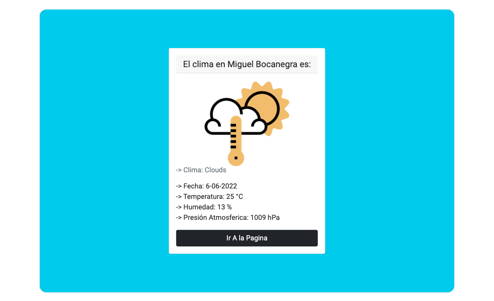

# Pagina WEB - Clima

***Documento sobre este repositorio***

Esta es una Aplicacion Local de clima utilizando API de https://openweathermap.org/api

Esta aplicacion se creo con bootstrap 3 inicialmente pero se actualizo hasta lo que hoy se tiene con Bootstrap V5.

# Tecnologias Aplicadas.

- HTML5

- CSS

- Bootstrap V5

- Javascript

# Vista Previa Pagina Funcionando

